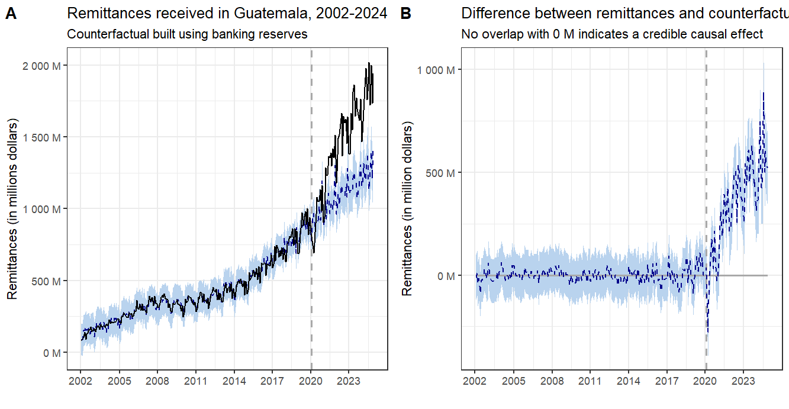

# The Effect of the COVID-19 pandemic on Remittances in Guatemala: A Causal Impact Analysis
## Introduction 
Here, we provide the code and data needed to replicate our study of remittances in Guatemala published in [Economic Letters](https://www.sciencedirect.com/journal/economics-letters). 

#Summary Figure

This combined figure shows the causal impact (A) and excess estimates (B). 

## Citation 
> Santos-Lozada, Alexis R. and Cuxil, Ernesto (2025). The effects of the COVID-19 pandemic on Remittances in Guatemala: A Causal Impact Analysis. *Economic Letters*.
 
## Authors
Santos-Lozada, Alexis R. $^{1}$ and Cuxil, Ernesto $^{2}$ 

$^{1}$ Department of Human Development and Family Studies, The Pennsylvania State University, University Park, PA 16802 

$^{2}$ Independent Researcher, Guuatemala

## Content
This repository incldes:

* Processed data on remittances (in USD) and foreing currency reserves (in Quetzales) for Guatemala 2002-2024
* Code contains the R code used to produce our analysis.

